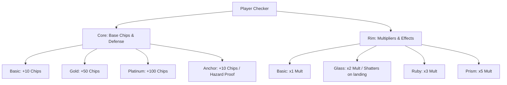

# Tavlatus: Game Design Document

Tavlatus is a single-player rogue-like deckbuilder and backgammon hybrid. It fuses the movement and blocking rules of traditional Backgammon with modern deckbuilding scaling and run structures (inspired by games like *Balatro*). Players modify their starting checkers, custom-build their board's tile effects, and score chips to beat round targets while defending against relentless enemy invasions.

---

## 1. High Concept & Aesthetic Feel

### The Concept
"Backgammon meets Roguelike Drafting." Instead of playing against a mirroring opponent, the player moves their pieces (checkers) from the top-right, down the left side, and into the bottom-right **Attack zone** (traditionally the Bear-Off area) to score points (Chips x Mult). The enemy pieces advance in the opposite direction from the top-left towards the player's starting base, acting as obstacles, gates, and hostile units. 

### Aesthetic & Mood
- **Art-Deco Cyber-Velvet**: The game features a dark, atmospheric board with gold and teal geometric lines. Velvet-textured radial gradients, golden corners, and glowing indicators establish a premium, tactile board-game environment.
- **Fluid Movement**: Checkers do not tele-transport; they leap gracefully from pip to pip, tracing dynamic, curved physical arcs. Allied and enemy checkers curve in opposite directions to prevent visual overlaps when passing each other.
- **Physics-Based Feedback**: Collisions carry physical weight. Striking an enemy checker sends it spinning off-screen under gravity before it lands in the enemy holding area. Shattering a *Glass Rim* checker bursts custom light-blue shard particles across the board, accompanied by a physical screen shake.
- **Dynamic Background**: The background features smooth, continuous vector-wave washes. The speed and intensity of these background waves scale dynamically with the player's current global score multiplier, making the game feel "alive" and reactive as the player builds high-scoring combos.

---

## 2. Core Gameplay Loop

Each level of Tavlatus is structured around a **Run** of multiple blinds (Small Blind, Big Blind, Boss Blind):
1. **The Roll**: Dice roll automatically at the start of the turn.
2. **The Move**: The player selects an allied checker and moves it according to the rolled die values. 
3. **Scoring & Pass-Over**: Each step of the move triggers points and any pass-over effects on the tiles (pips) the checker jumps over, culminating in landing effects.
4. **Enemy Turn**: After the player ends their turn, the enemy phase begins. The enemy checkers consume preset **Move Tokens** to advance towards the player's base, capturing unprotected allied checkers.
5. **Clear or Fail**: The round continues until the player reaches the target score (allowing them to click **Win** and visit the Shop) or runs out of checkers/rolls (resulting in a failed run).

---

## 3. Scoring Mechanics

Moves in Tavlatus generate score using a classic **Chips & Multiplier (Mult)** system:
$$\text{Move Score} = (\text{Base Chips} + \text{Bonuses}) \times (\text{Global Mult} \times \text{Checker/Tile Multipliers})$$

### Scoring Triggers
- **Base Move Score**: Every pip moved scores $10 \text{ Chips} \times \text{die value}$.
- **Allied Landing**: Landing on a pip already occupied by friendly checkers yields $+50 \text{ Chips}$ for each allied checker already present.
- **Break**: Landing on a pip occupied by a single, vulnerable enemy checker **breaks** (captures) it, earning $+200 \text{ Chips}$ and sending the enemy to the Attacked Enemies bar.
- **Attack Area Entry**: Moving a checker past the 24th pip exits the board, scoring $+250 \text{ Chips}$ and removing the checker from play.
- **Pass-Over Hooks**: Checkers jump pip-by-pip. Moving over pips containing modifiers can trigger passive score additions or multiplier hooks during transit, letting players "route" their moves for maximum score.

---

## 4. Player Checker Archetypes (Cores & Rims)

Player checkers are modular entities defined by two attributes: a **Core** (which sets base chips and hazards defense) and a **Rim** (which dictates score multipliers).

### Checker Cores (Vulnerability & Value)
- **Basic Core**: Gives $+10 \text{ Chips}$. Vulnerable to enemy attacks and hazards.
- **Gold Core**: Gives $+50 \text{ Chips}$. High scoring, but still vulnerable.
- **Platinum Core**: Gives $+100 \text{ Chips}$. Elite scoring potential.
- **Anchor Core**: Gives $+10 \text{ Chips}$. Invulnerable to enemy attacks and hazard pips (cannot be sent to the bar or destroyed).

### Checker Rims (Multipliers)
- **Basic Rim**: Applies a $1\times$ multiplier.
- **Glass Rim**: Applies a $2\times$ multiplier. However, it is fragile; it shatters (destroying the checker) when an *enemy* checker lands on it, when a Ram dislodges it, or when an enemy passes over it during its advance. A Glass-Rim checker reinforced by an **Anchor Core** is spared from shattering. Player checkers landing on or passing over a Glass-Rim checker do **not** shatter it.
- **Ruby Rim**: Applies a $3\times$ multiplier.
- **Prism Rim**: Applies a premium $5\times$ multiplier.

---

## 5. Board Modifiers (Relic-Pips)

The board consists of 24 pips. The bottom 12 pips represent the player's **Deck**. Players buy **Relic-Pips** in the shop and permanently place them onto these deck slots to customize their scoring board:

| Relic-Pip | Symbol | In-Transit (Pass-Over) Effect | Landing Effect |
| :--- | :---: | :--- | :--- |
| **The Forge** | **F** | Adds $+5 \text{ Chips}$ to the move. | Upgrades the landing checker's rim tier (Basic $\to$ Glass $\to$ Ruby $\to$ Prism) for the rest of the level. |
| **The Market** | **M** | Adds $+0.25\times \text{ Mult}$ to the move. | Doubles the final Chip value of that move. |
| **Iron Gate** | **I** | None | Breaking a red enemy checker on this pip grants $+2$ global Mult for the rest of the round. |
| **Haste Line** | **H** | None | Landing here with a die value of $5$ or $6$ adds $+20 \text{ Chips}$ to the move. |
| **Ledger Pip** | **$** | None | Breaking a red enemy checker on this pip immediately awards $+1 \text{ Akçe}$. |
| **Dealer Pip** | **+** | None | Landing here grants $+1$ global Mult for the rest of the round. |

---

## 6. Enemy Behavior & Obstacles

The enemy does not take random actions. Instead, they act as deterministic obstacles on the board:

### Enemy Checkers
- **Pawns**: Standard red checkers. They advance up to the current Move Token's value (currently 3 pips), always taking the largest legal distance. If they land on a pip holding a single player checker, they capture it and send it to the Allied Bar. If the player has two or more checkers on a pip (forming a "Gate"), Pawns cannot pass it; they instead resolve to the largest shorter distance still open (which may be 1 pip, or none if totally blocked).
- **Rams**: Elite heavy units. Rams advance up to the Move Token's value and can actively breach a defended allied gate when closing at exactly 2 pips, dislodging one of the player's non-Anchor checkers to the Allied Bar (or shattering it on the spot if it has a Glass Rim).

### Enemy Phase & Move Tokens
- At the start of the level, the enemy's upcoming movements are displayed as a row of blue **Move Tokens** (e.g. `[3, 3, 3, 3]`).
- During the enemy phase, the enemy consumes these tokens one-by-one.
- The move budget is split evenly each phase: **half the tokens advance the rearmost enemy checkers** (highest index, farthest from the player's base) and **half advance the vanguard** (lowest index, closest to the player's base). With four tokens this means two rear + two vanguard. One mover is chosen per occupied pip (Rams prioritized over Pawns within a pip), and each advances by its token's value.
- If an enemy checker moves off past the player's base (past pip 0), it escapes/attacks and is queued to re-enter on a later enemy turn. Any escape also voids the round's **Mars** payout bonus.

### Re-entry & The Bars
- **Allied Bar**: Captured player checkers are sent here and must re-enter the board at the starting area (pips 0-5) using dice before any other checker can move.
- **Attacked Enemies (Enemy Bar)**: Captured enemy checkers are held here. At the start of the enemy turn, captured enemy checkers re-enter play at the enemy's starting area.

---

## 7. Economy & The Shop

Clearing a blind allows players to visit the Shop, using their accumulated **Akçe** (earned by clearing rounds, banking unused rolls as interest, and breaking enemies on Ledger Pips) to upgrade their engine.

### Akçe Payout Mechanics
- **Blind Payout**: Clearing a standard blind pays $3 \text{ Akçe}$. Clearing a Boss Blind pays $5 \text{ Akçe}$.
- **Interest Payout**: Every unused die roll remaining in the player's pool at the end of the round pays $+1 \text{ Akçe}$.
- **Mars Bonus**: If the player beats the target score and wins the round before any enemy checker reaches the player's base, they earn a **Mars Payout**, doubling the total money rewarded.

### Shop Draft Categories
The shop drafts 9 items divided into three rows:
1. **Relic-Pips**: Modifiers (Forge, Market, etc.) to place onto the bottom 12 deck slots. Buying a relic-pip lets the player inspect the board, hide the shop, and click a deck slot to place it (replacing any existing modifier).
2. **Checker Drafts**: Specialized pre-configured checkers (Golden, Glass, Anchor, Ruby, Prism, and the in-progress **Sprinter**) that can replace one of the player's 10 starting checkers. Note: the **Sprinter** is a work-in-progress draft with no special ability implemented yet — it currently behaves as a standard (basic/basic) checker.
3. **Core & Rim Upgrades**: Permanent upgrades that can be applied directly to a selected starting checker on the board (e.g. upgrading a checker's core to Gold, or its rim to Prism).

---

## 8. User Experience & Mechanical Synergy

- **Deselect & Plan**: Players can select checkers to preview paths, check legal landing zones, and preview exact score calculations before finalizing a move.
- **Inspect Board**: The "Hide Store" option in the shop dims the shop overlay completely, allowing players to look at the exact state of the board and layout before deciding what modifiers to buy or where to place them.
- **Roguish Adaptability**: Because the player upgrades their persistent starting checkers, they can build synergies—for example, upgrading a checker to have an Anchor Core (ignoring hazards) and a Prism Rim (x5 Mult), or combining Forge Pips with Glass Rims to build high-risk, high-multiplier scoring runs.
